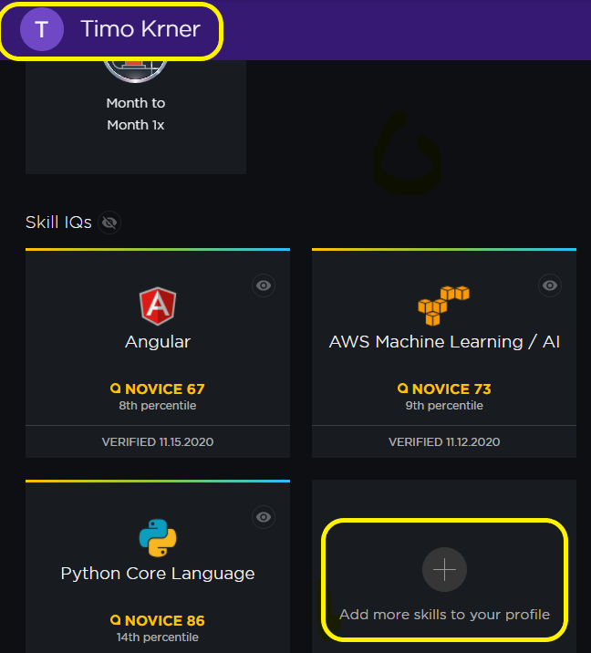
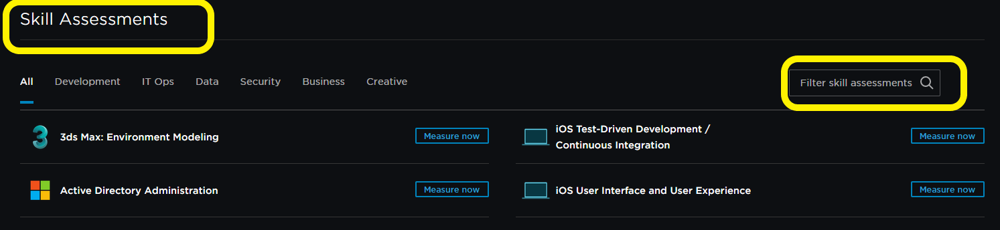

## Pluralsight-quiz-questions

## Getting Started

- Create a free **Pluralsight Account** and do a test
- [Signup](https://app.pluralsight.com) and get an account
- In your profile (top right on dashboard) click on **+ Add more skills to your profile** (see image 1)
- You should now be on the [SkillIQ site](https://app.pluralsight.com/skilliq)
- Enter a Search Name for the skill assessments on the right, like **IOS TDD** or **React**(Image 2)
- Select one and Start the test (**Show off!**)

&nbsp;

Image 1

&nbsp;
&nbsp;

Image 2
